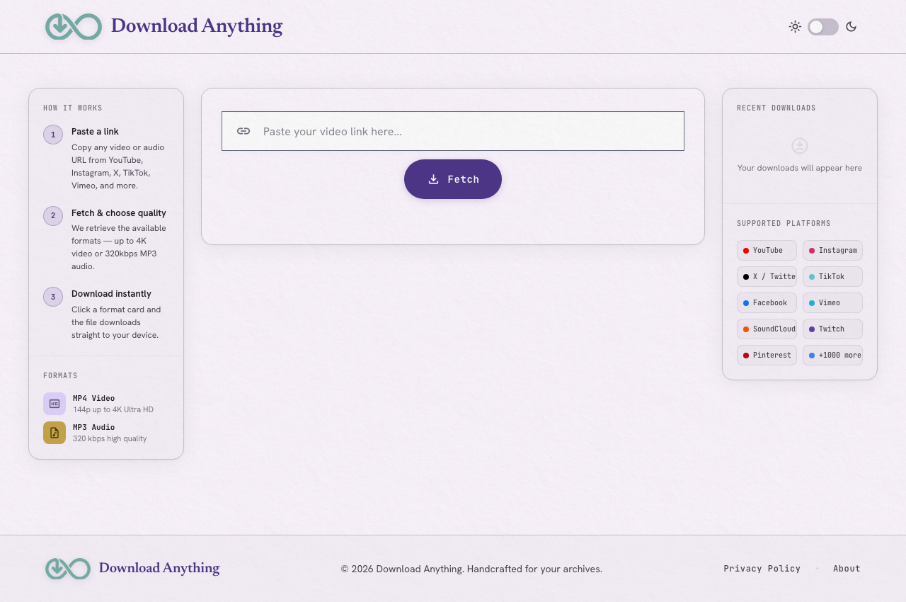
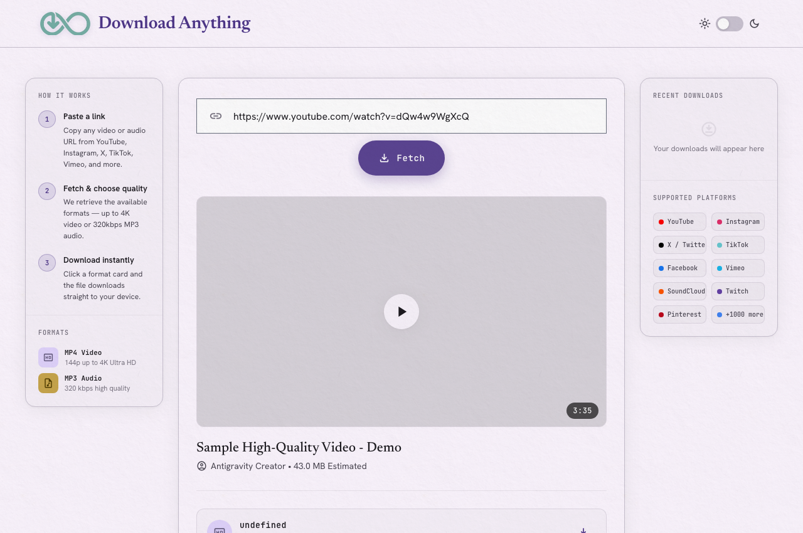

# DownloadAnything 🎬💾


Hey there! Welcome to **DownloadAnything** — a simple, clean, and fast web application designed to help you download video and audio files from your favorite online platforms without hassle, ads, or shady popups.

---

## 🎨 User Interface & Usage

### 🏠 Main Interface


### 📥 Media Extraction & Format Options


---

## ✨ Features

- ⚡ **Fast & Responsive UI**: Clean interface built for speed and ease of use.
- 🎵 **Video & Audio Downloads**: Choose between different qualities or extract audio tracks directly.
- 📡 **Real-time Progress Updates**: Live download progress streamed straight to your browser using Server-Sent Events (SSE).
- 🧹 **Automatic Cleanup**: Keeps temporary files tidy automatically after downloads complete.

---

## 🚀 Getting Started

### Prerequisites

Make sure you have Python 3.9+ installed on your system. Having **Node.js** installed on your system is also recommended, as `yt-dlp` can use it to solve JavaScript challenges on platforms like YouTube.

### Installation

1. **Clone the repository** (or download the files):
   ```bash
   git clone https://github.com/your-username/DownloadAnything.git
   cd DownloadAnything
   ```

2. **Create and activate a virtual environment**:
   ```bash
   python -m venv venv
   source venv/bin/activate  # On Windows use: venv\Scripts\activate
   ```

3. **Install the dependencies**:
   ```bash
   pip install -r requirements.txt
   ```

### 🚀 Running the App

#### Option A: One-Click Startup (Recommended)
- **macOS / Linux**:
  ```bash
  ./run.sh
  ```
- **Windows**:
  Double-click `run.bat` (or run in Command Prompt / PowerShell: `run.bat`).

The script automatically prepares the virtual environment, verifies dependencies, starts the server, and opens your browser to `http://127.0.0.1:8000`.

#### Option B: Standalone Precompiled Executable
Download the precompiled standalone package for your operating system from the [Releases](../../releases) tab:
- **macOS**: `DownloadAnything-v1.0.0-macos-arm64.tar.gz` (Apple Silicon)
- **Windows**: `DownloadAnything-v1.0.0-windows-x64.zip` (contains `DownloadAnything-v1.0.0.exe`)
- **Linux**: `DownloadAnything-v1.0.0-linux-x86_64.tar.gz`

Extract and double-click or run from terminal — **no Python, pip, or external dependencies required!** A static FFmpeg binary is bundled directly into the executable.

#### Option C: Build Standalone Executable Locally
To compile the standalone binary locally for your current OS:
```bash
python build.py
```
The compiled executable will be generated inside the `dist/` directory.

---

## 🛠️ Built With & Special Thanks

DownloadAnything stands on the shoulders of some incredible open-source tools. Big shoutout and massive appreciation to the developers and maintainers behind these projects:

* 🐍 **[FastAPI](https://fastapi.tiangolo.com/)** — Powered by FastAPI for a high-performance Python web backend.
* 🎥 **[yt-dlp](https://github.com/yt-dlp/yt-dlp)** — The heart of our media engine, doing all the heavy lifting for media extraction across hundreds of sites.
* ⚡ **[Uvicorn](https://www.uvicorn.org/)** — Lightning-fast ASGI server powering our backend service.
* 🛰️ **[sse-starlette](https://github.com/sysid/sse-starlette)** — Enabling smooth, real-time Server-Sent Events progress streams.
* 📋 **[Pydantic](https://docs.pydantic.dev/)** — Reliable data validation and settings management.
* 🧪 **[pytest](https://docs.pytest.org/)** & **[HTTPX](https://www.python-httpx.org/)** — Making backend and API testing seamless.

---

## 🤝 Contributing

Contributions, feedback, and suggestions are always welcome! If you run into issues or have ideas for improvements, feel free to open an issue or submit a pull request.

Happy downloading! 🎉

---

## ⚖️ Disclaimer / Legal Notice

Download Anything is an open-source tool developed solely for educational and personal archiving purposes. The application does not host, store, or distribute copyrighted material. The user is solely responsible for verifying the intellectual property rights of the content they process and for complying with applicable local laws, as well as the terms of service of the origin platforms. The software is provided "AS IS", without warranties of any kind.

---

<sub>*README generated with AI assistance by Antigravity (Google DeepMind).*</sub>

